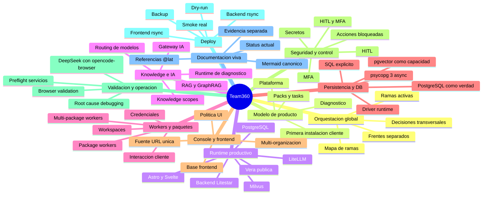

# Team360 Knowledge Map

## Proposito

Definir un arbol de conocimiento navegable para `lat.md/` usando Mermaid como
fuente versionable en Git.

Este mapa no reemplaza los documentos conceptuales. Sirve como vista de
orientacion para entender como se conectan arquitectura, runtime, knowledge,
operacion y politicas transversales.

## Regla

```text
lat.md documents
-> Mermaid mindmap
-> optional rendered artifact only when needed
```

El mapa debe mantenerse pequeno, legible y alineado con
[[team360-mermaid-diagram-policy]].

## Mapa principal



## Referencias canonicas

- Orquestacion global: [[team360-global-orchestration]]
- Modelo de producto: [[team360-platform]],
  [[team360-pack-task-diagnosis-model]], [[automation-diagnosis]],
  [[customer-packaged-assistant-instance]]
- Runtime productivo: [[team360-runtime-operational-policy]]
- Knowledge e IA: [[knowledge-rag-graphrag]], [[knowledge-scope-contract]],
  [[ai-diagnosis-rag-runtime]], [[ai-litellm]], [[model-selection-routing]]
- Workers y paquetes: [[multi-package-workers]]
- Persistencia y DB: [[postgres-ai-persistence]], [[postgres-driver-policy]]
- Console y frontend: [[console-multi-organization]],
  [[team360-frontend-base]], [[team360-frontend-ui-policy]],
  [[team360-frontend-url-source-of-truth]]
- Seguridad y control: [[security-hitl-mfa]]
- Validacion y operacion: [[service-preflight-methodology]],
  [[browser-mcp-validation-policy]], [[deepseek-v4-flash-opencode-browser]],
  [[team360-root-cause-debugging-policy]]
- Deploy: [[team360-frontend-rsync-deploy-policy]],
  [[team360-backend-rsync-deploy-policy]]
- Documentacion viva: [[team360-mermaid-diagram-policy]]

## Como mantenerlo

- Agregar solo conceptos estables que ya existan o que se documenten en
  `lat.md/`.
- Usar referencias `[[...]]` cuando el nodo apunte a un documento canonico.
- Mantener ramas del arbol entre 3 y 8 nodos cuando sea posible.
- No convertir este mapa en bitacora diaria.
- Si el mapa crece demasiado, dividirlo en mapas mas chicos por dominio.

## Limites

Este mapa es orientativo. La fuente de verdad sigue siendo cada documento
conceptual enlazado y las bitacoras `status_actual.md` correspondientes.

No valida implementacion, deploy, tests ni calidad del runtime.
