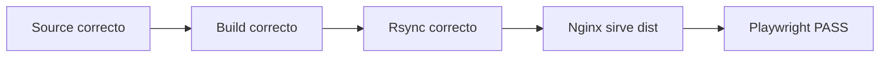

# Team360 Mermaid Diagram Policy

## Proposito

Definir el uso canonico de diagramas en Team360 sin incorporar dependencias,
estado externo ni automatismos de herramientas de terceros.

Regla central:

```text
Mermaid source in Git
→ optional rendered artifacts only when needed
```

## Fuente canonica

Mermaid es la fuente de verdad para diagramas tecnicos de Team360.

Los diagramas deben vivir como texto:

- embebidos en Markdown mediante fences `mermaid`;
- o en archivos `.mmd` cuando el diagrama sea largo o reutilizable.

SVG, PNG, PDF o Excalidraw son artefactos derivados. No deben convertirse en
la fuente principal de una decision tecnica.

## Ubicacion

Usar la estructura documental existente:

| Caso | Ubicacion |
|---|---|
| Arquitectura viva, invariantes, politicas transversales | `lat.md/*.md` |
| Diagramas tecnicos de runtime, backend, Astro, migraciones o validacion | `SrvRestAstroLS_v1/docs/*.md` |
| Reportes exportables, evidencias, snapshots o entregables | `data/reports/**` |

No crear un directorio generico `diagrams/` en la raiz salvo decision explicita
y documentada.

## Instalacion

No hay instalacion global obligatoria de Mermaid para Team360.

El estandar documental no depende de `mmdc`, extensiones del editor ni
herramientas globales.

Si en el futuro se requiere render automatico, CI o generacion reproducible de
SVG/PNG, la dependencia debe instalarse localmente y versionarse en el proyecto,
por ejemplo con `@mermaid-js/mermaid-cli` como dependencia de desarrollo.

Instalaciones globales solo son aceptables para diagnostico personal o pruebas
rapidas de una maquina. No son evidencia reproducible ni requisito de PASS.

## Estilo

Preferir diagramas pequenos y revisables:

- 5 a 15 nodos como rango normal;
- etiquetas cortas en nodos;
- detalles en las flechas;
- `graph LR` para pipelines y flujos;
- `graph TD` para jerarquias;
- dividir diagramas grandes en varios diagramas mas pequenos.

Ejemplo:



## Validacion

Antes de considerar valido un diagrama:

- debe representar una regla, flujo o arquitectura real;
- debe estar alineado con el documento donde vive;
- no debe contradecir `lat.md/lat.md`, `status_actual.md` ni politicas
  operativas vigentes;
- si se renderiza, el Mermaid debe parsear correctamente.

Un diagrama no reemplaza tests, smoke, Playwright ni evidencia operativa.
Solo explica el sistema.

## Relacion con gstack `/diagram`

Team360 toma de gstack `/diagram` la idea util de mantener una fuente textual
versionable y renderizar artefactos solo cuando aportan valor.

Team360 no adopta el skill completo, su preambulo, telemetry, estado global,
routing, hooks, commits automaticos ni dependencias del browse daemon.

La politica Team360 es mas simple:

```text
Mermaid primero.
Render despues, solo si hace falta.
Sin dependencia global como requisito.
```
